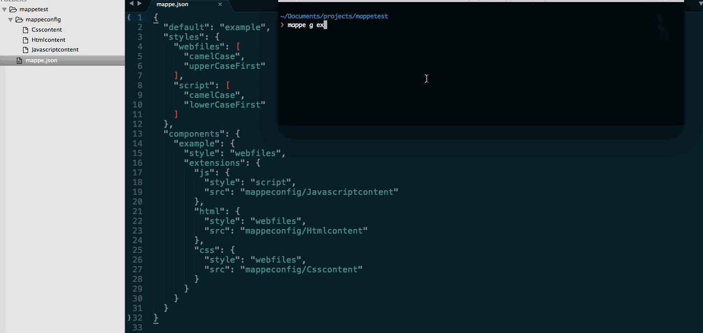

#MappeJS 
[](https://travis-ci.org/elenatorro/MappeJS)
[]()
[](https://paypal.me/elenatorro)
[](https://www.npmjs.org/package/mappe)
[](https://david-dm.org/elenatorro/MappeJS)

CLI tool that helps with the process of managing project folders and files based on components. Let's say you're building a web application and you want to create a new component.

Component:

```
- component/
 |_ component.html
 |_ component.service.js
 |_ component.factory.js
 |_ component.css
```

##Current Options
###Configuration
* Create a mappe.json file for custom configuration. If you don't, a new mappe.json file will be created with the default configuration:

```
{
    default: 'default',
    styles: {
      default: ['camelCase', 'upperCaseFirst']
    },
    components: {
      default: {
        style: 'default',
        extensions: {
          js: {
            style : 'default',
            src: false // 'src/to/file/content'
          }
        }
      }
    }
  }
```

###Generate Component
```
$ mappe generate default index component
$ mappe g default index component
```

Result:

```
- IndexComponent/
 |_ IndexComponent.js
```

If you set a src path for an extension, it will be created with the content of the file found in this path. It's perfect for generating boilerplates or file structures by default.



More info at [https://elenatorro.github.io/MappeJS](https://elenatorro.github.io/MappeJS)

####Available styles in [change-case npm package](https://www.npmjs.com/package/change-case)

* upperCase
* ucFirstCase
* lcFirstCase
* lowerCase
* sentenceCase
* titleCase
* camelCase
* pascalCase
* snakeCase
* paramCase
* dotCase
* pathCase
* constantCase
* swapCase

